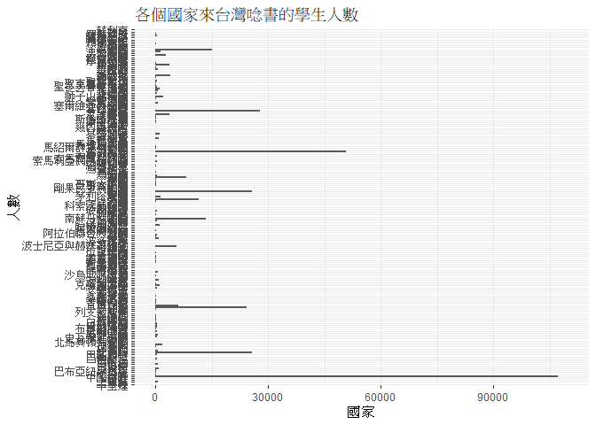
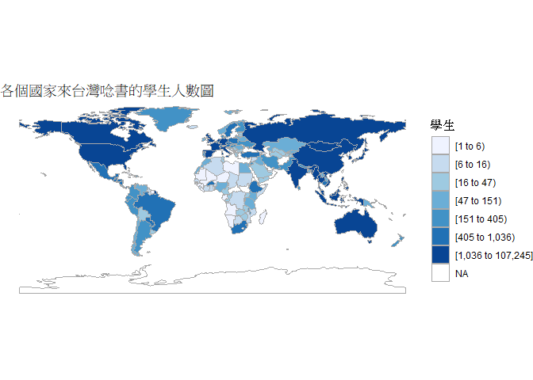
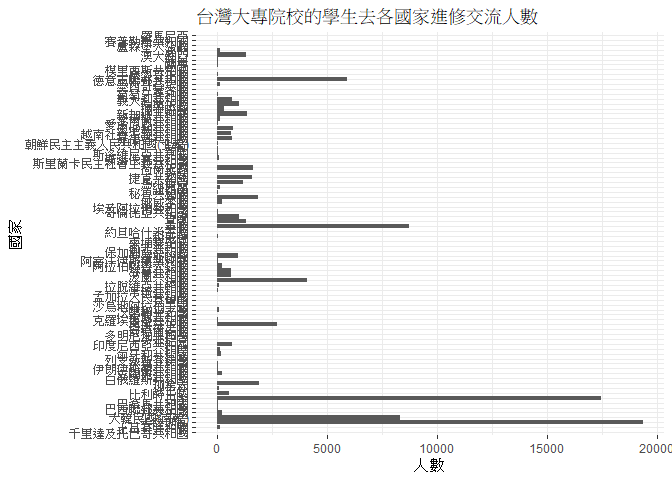
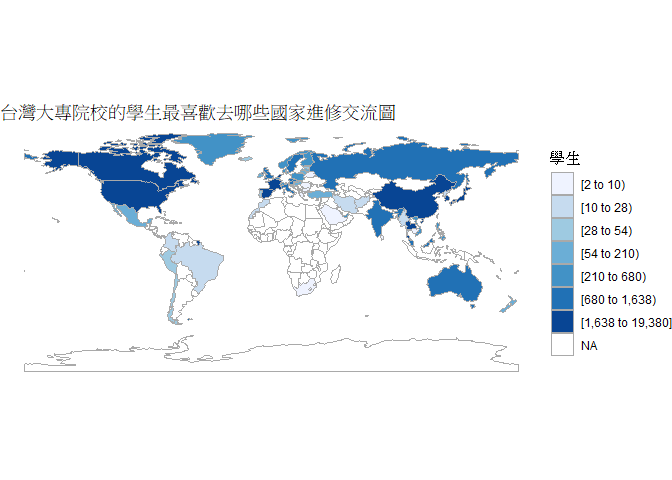
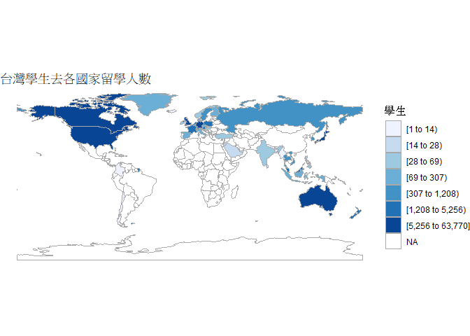
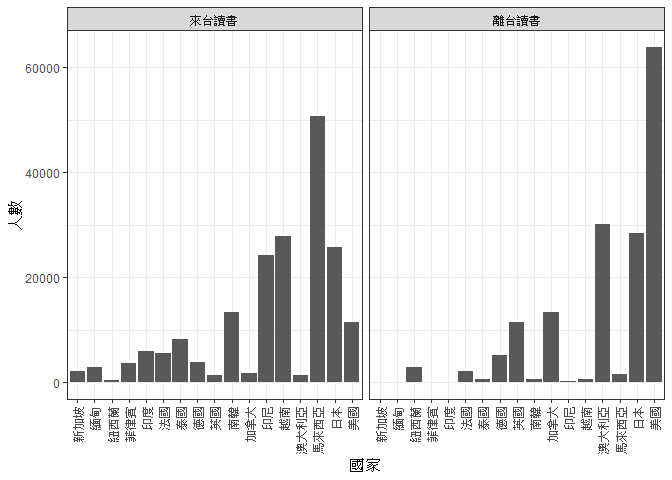

108-2 大數據分析方法 作業二
================
Yi-Ju Tseng

作業完整說明[連結](https://docs.google.com/document/d/1aLGSsGXhgOVgwzSg9JdaNz2qGPQJSoupDAQownkGf_I/edit?usp=sharing)

學習再也不限定在自己出生的國家，台灣每年有許多學生選擇就讀國外的大專院校，同時也有人多國外的學生來台灣就讀，透過分析大專校院境外學生人數統計、大專校院本國學生出國進修交流數、世界各主要國家之我國留學生人數統計表可以了解各大專院校國際交流的情形。請同學分析以下議題，並以視覺化的方式呈現分析結果，呈現105-107年以後大專院校國際交流的情形
(如提供網址資料有缺少年份，可嘗試自己google一下需要年份的資料)。

## 來台境外生分析

### 資料匯入與處理

``` r
library(readr)
library(dplyr)
```

    ## 
    ## Attaching package: 'dplyr'

    ## The following objects are masked from 'package:stats':
    ## 
    ##     filter, lag

    ## The following objects are masked from 'package:base':
    ## 
    ##     intersect, setdiff, setequal, union

``` r
library(tidyr)
DomStudy107 <- read_csv("C:/Users/jarsh/OneDrive/桌面/BD2/107_ab107_C.csv")
```

    ## Parsed with column specification:
    ## cols(
    ##   洲別 = col_character(),
    ##   國別 = col_character(),
    ##   學位生_正式修讀學位外國生 = col_double(),
    ##   `學位生_僑生(含港澳)` = col_double(),
    ##   學位生_正式修讀學位陸生 = col_double(),
    ##   非學位生_外國交換生 = col_double(),
    ##   非學位生_外國短期研習及個人選讀 = col_double(),
    ##   非學位生_大專附設華語文中心學生 = col_double(),
    ##   非學位生_大陸研修生 = col_double(),
    ##   非學位生_海青班 = col_double(),
    ##   境外專班 = col_double()
    ## )

``` r
DomStudy106 <- read_csv("C:/Users/jarsh/OneDrive/桌面/BD2/106_ab106_C.csv")
```

    ## Parsed with column specification:
    ## cols(
    ##   洲別 = col_character(),
    ##   國別 = col_character(),
    ##   學位生_正式修讀學位外國生 = col_number(),
    ##   `學位生_僑生(含港澳)` = col_number(),
    ##   學位生_正式修讀學位陸生 = col_number(),
    ##   非學位生_外國交換生 = col_double(),
    ##   非學位生_外國短期研習及個人選讀 = col_number(),
    ##   非學位生_大專附設華語文中心學生 = col_number(),
    ##   非學位生_大陸研修生 = col_number(),
    ##   非學位生_海青班 = col_number(),
    ##   境外專班 = col_double()
    ## )

``` r
DomStudy105 <- read_csv("C:/Users/jarsh/OneDrive/桌面/BD2/105_ab105_C.csv")
```

    ## Parsed with column specification:
    ## cols(
    ##   洲別 = col_character(),
    ##   國別 = col_character(),
    ##   學位生_正式修讀學位外國生 = col_double(),
    ##   `學位生_僑生(含港澳)` = col_double(),
    ##   學位生_正式修讀學位陸生 = col_double(),
    ##   非學位生_外國交換生 = col_double(),
    ##   非學位生_外國短期研習及個人選讀 = col_double(),
    ##   非學位生_大專附設華語文中心學生 = col_double(),
    ##   非學位生_大陸研修生 = col_double(),
    ##   非學位生_海青班 = col_double(),
    ##   境外專班 = col_double()
    ## )

``` r
DomStudy105<-DomStudy105[-1]
DomStudy106<-DomStudy106[-1]
DomStudy107<-DomStudy107[-1]
DomStudy106$國別<-gsub("大陸地區","中國大陸",DomStudy106$國別)
DomStudy107$國別<-gsub("大陸地區","中國大陸",DomStudy107$國別)

CN<-full_join(DomStudy105,DomStudy106, by="國別")
CN<-full_join(CN,DomStudy107, by="國別")
```

### 哪些國家來台灣唸書的學生最多呢？

``` r
#這是R Code Chunk
CNgather<-
  gather(CN,
         a,student,
         colnames(CN[-1]))[-2]
CNgather<-CNgather[complete.cases(CNgather),]
CNgather<-
  group_by(CNgather,國別) %>%
  summarise(student=sum(student)) 
CNgather<-CNgather[order(CNgather$student,decreasing = T),]


knitr::kable(head(CNgather,10))
```

| 國別   | student |
| :--- | ------: |
| 中國大陸 |  107245 |
| 馬來西亞 |   50771 |
| 越南   |   27895 |
| 香港   |   25720 |
| 日本   |   25690 |
| 印尼   |   24243 |
| 澳門   |   15141 |
| 南韓   |   13441 |
| 美國   |   11385 |
| 泰國   |    8195 |

這十名國家除了第一名是中國大陸，再來是東南亞，更預想的結果沒太大出路，畢竟媒體常報導陸生、台南亞學生，不過韓國、日本的學生較少聽到，也沒在路上看過。

### 哪間大學的境外生最多呢？

``` r
DomStudy107S <- read_csv("C:/Users/jarsh/OneDrive/桌面/BD2/107_ab107_S.csv")
```

    ## Parsed with column specification:
    ## cols(
    ##   學校類型 = col_character(),
    ##   學校代碼 = col_character(),
    ##   學校名稱 = col_character(),
    ##   學位生_正式修讀學位外國生 = col_double(),
    ##   `學位生_僑生(含港澳)` = col_double(),
    ##   學位生_正式修讀學位陸生 = col_double(),
    ##   非學位生_外國交換生 = col_double(),
    ##   非學位生_外國短期研習及個人選讀 = col_double(),
    ##   非學位生_大專附設華語文中心學生 = col_double(),
    ##   非學位生_大陸研修生 = col_double(),
    ##   非學位生_海青班 = col_double(),
    ##   境外專班 = col_double()
    ## )

``` r
DomStudy106S <- read_csv("C:/Users/jarsh/OneDrive/桌面/BD2/106_ab106_S.csv")
```

    ## Parsed with column specification:
    ## cols(
    ##   學校類型 = col_character(),
    ##   學校代碼 = col_character(),
    ##   學校名稱 = col_character(),
    ##   學位生_正式修讀學位外國生 = col_double(),
    ##   `學位生_僑生(含港澳)` = col_double(),
    ##   學位生_正式修讀學位陸生 = col_double(),
    ##   非學位生_外國交換生 = col_double(),
    ##   非學位生_外國短期研習及個人選讀 = col_double(),
    ##   非學位生_大專附設華語文中心學生 = col_double(),
    ##   非學位生_大陸研修生 = col_double(),
    ##   非學位生_海青班 = col_double(),
    ##   境外專班 = col_double()
    ## )

``` r
DomStudy105S <- read_csv("C:/Users/jarsh/OneDrive/桌面/BD2/105_ab105_S.csv")
```

    ## Parsed with column specification:
    ## cols(
    ##   學校類型 = col_character(),
    ##   學校代碼 = col_character(),
    ##   學校名稱 = col_character(),
    ##   學位生_正式修讀學位外國生 = col_double(),
    ##   `學位生_僑生(含港澳)` = col_double(),
    ##   學位生_正式修讀學位陸生 = col_double(),
    ##   非學位生_外國交換生 = col_double(),
    ##   非學位生_外國短期研習及個人選讀 = col_double(),
    ##   非學位生_大專附設華語文中心學生 = col_double(),
    ##   非學位生_大陸研修生 = col_double(),
    ##   非學位生_海青班 = col_double(),
    ##   境外專班 = col_double()
    ## )

``` r
DomStudy105S<-DomStudy105S[c(-1,-2)]
DomStudy106S<-DomStudy106S[c(-1,-2)]
DomStudy107S<-DomStudy107S[c(-1,-2)]

DomStudy105S<-
  gather(DomStudy105S,
       country,student,
       colnames(DomStudy105S[c(-1)]))[-2]
DomStudy106S<-
  gather(DomStudy106S,
         country,student,
         colnames(DomStudy106S[c(-1)]))[-2]
DomStudy107S<-
  gather(DomStudy107S,
         country,student,
         colnames(DomStudy107S[c(-1)]))[-2]
DomStudyTotal<-rbind(DomStudy105S,DomStudy106S)
DomStudyTotal<-rbind(DomStudyTotal,DomStudy107S)
DomStudyTotal<-
  group_by(DomStudyTotal,學校名稱) %>%
    summarise(student=sum(student))

DomStudyTotal<-DomStudyTotal[order(DomStudyTotal$student,decreasing = T),]
head(DomStudyTotal,10)
```

    ## # A tibble: 10 x 2
    ##    學校名稱         student
    ##    <chr>              <dbl>
    ##  1 無法區分校別       79069
    ##  2 國立臺灣師範大學   18501
    ##  3 國立臺灣大學       14502
    ##  4 銘傳大學           12120
    ##  5 淡江大學           11903
    ##  6 中國文化大學       11139
    ##  7 國立成功大學        9409
    ##  8 國立政治大學        9020
    ##  9 逢甲大學            8016
    ## 10 中原大學            8003

``` r
knitr::kable(head(DomStudyTotal,10))
```

| 學校名稱     | student |
| :------- | ------: |
| 無法區分校別   |   79069 |
| 國立臺灣師範大學 |   18501 |
| 國立臺灣大學   |   14502 |
| 銘傳大學     |   12120 |
| 淡江大學     |   11903 |
| 中國文化大學   |   11139 |
| 國立成功大學   |    9409 |
| 國立政治大學   |    9020 |
| 逢甲大學     |    8016 |
| 中原大學     |    8003 |

第一名是無法區分校別也許是有些人已離開學校，但還在以學生的身分留在台灣，第二名是國立臺灣師範大學有可能是來台學中文，第三是台大則是是全台最高學府，其他求十名的大學都是聽過的大學，所以蠻合理的。

### 各個國家來台灣唸書的學生人數長條圖

``` r
library(ggrepel)
```

    ## Loading required package: ggplot2

``` r
ggplot()+geom_bar(data=CNgather,
                  aes(x=國別,y=student),
                  stat = "identity")+
  coord_flip()+
  labs(title = '各個國家來台灣唸書的學生人數',x = "人數",y = "國家")+
  theme_bw()+
  ylim(0,110000)+
  theme(panel.border = element_blank())
```

<!-- -->

從長條圖可大致分析出會來台讀書的國家不是特多、就是特少，第一多的是中國大陸107245人，第二則是馬來西亞50771人，難怪台灣常報導大陸對台灣經濟的影響，不只是觀光屬中國人較多，連來台留學也是中國人較多。

### 各個國家來台灣唸書的學生人數面量圖

``` r
library(choroplethr)
```

    ## Loading required package: acs

    ## Loading required package: stringr

    ## Loading required package: XML

    ## 
    ## Attaching package: 'acs'

    ## The following object is masked from 'package:dplyr':
    ## 
    ##     combine

    ## The following object is masked from 'package:base':
    ## 
    ##     apply

``` r
Country_English <- read_csv("C:/Users/jarsh/OneDrive/桌面/BD2/Country English.csv")
```

    ## Parsed with column specification:
    ## cols(
    ##   ISO3 = col_character(),
    ##   English = col_character(),
    ##   Taiwan = col_character()
    ## )

``` r
colnames(CNgather)[1]<-"Taiwan"
countrymap<-left_join(CNgather,Country_English,by="Taiwan")
countrymap<-countrymap[complete.cases(countrymap),]
countrymap<-data.frame(region=countrymap$English,value=countrymap$student)
countrymap<-countrymap%>%
  group_by(region)%>%
  summarise(value=sum(value))

country_choropleth(countrymap,title = "各個國家來台灣唸書的學生人數圖")+ 
  scale_fill_brewer(name="學生")
```

    ## Warning in super$initialize(country.map, user.df): Your data.frame contains the
    ## following regions which are not mappable: Singapore, Unmatch

    ## Warning: Column `region` joining character vector and factor, coercing into
    ## character vector

    ## Warning in self$bind(): The following regions were missing and are being set
    ## to NA: afghanistan, montenegro, oman, north korea, qatar, western sahara,
    ## south sudan, somaliland, east timor, taiwan, vanuatu, central african republic,
    ## northern cyprus, djibouti, eritrea, georgia, antarctica, equatorial guinea,
    ## kosovo

    ## Scale for 'fill' is already present. Adding another scale for 'fill', which
    ## will replace the existing scale.

<!-- -->

圖中有新加坡無法標記，還有幾個地區無留學生，比如：阿富汗、台灣、南極等，阿富汗可能是長年戰爭，台灣留學台灣沒邏輯，南極不是國家，美國、澳洲、亞洲顏色較深，但其實其中只有中國大陸是十萬多，其他國家的留學生差不多都是低於三萬，美國、澳洲常聽說到處留學，但俄羅斯就較少聽說，是來學醫還是學中文，須好好考察一下。

## 台灣學生國際交流分析

### 資料匯入與處理

``` r
dataset <- read_csv("C:/Users/jarsh/OneDrive/桌面/BD2/學5.日間學制本國學生出國進修交流人數-以「系(所)」統計.csv")
```

    ## Parsed with column specification:
    ## cols(
    ##   學年度 = col_double(),
    ##   學期 = col_double(),
    ##   設立別 = col_character(),
    ##   學校類別 = col_character(),
    ##   學校統計處代碼 = col_character(),
    ##   學校名稱 = col_character(),
    ##   系所代碼 = col_character(),
    ##   系所名稱 = col_character(),
    ##   `學制班別(日間)` = col_character(),
    ##   `進修交流國家(地區)別` = col_character(),
    ##   `進修交流國家(地區)區域別` = col_character(),
    ##   `本國學生出國進修交流至少1學期(修讀學分)以上人數小計` = col_double(),
    ##   `本國學生出國進修交流至少1學期(修讀學分)以上人數男` = col_double(),
    ##   `本國學生出國進修交流至少1學期(修讀學分)以上人數女` = col_double(),
    ##   `本國學生出國進修交流未滿1學期(修讀學分)人數小計` = col_double(),
    ##   `本國學生出國進修交流未滿1學期(修讀學分)人數男` = col_double(),
    ##   `本國學生出國進修交流未滿1學期(修讀學分)人數女` = col_double()
    ## )

``` r
datasetCountry <- dataset[c(10,12:17)]
datasetCountry<-
  gather(datasetCountry,
         country,student,
         colnames(datasetCountry[-1]))[-2]
datasetCountry<-group_by(datasetCountry,`進修交流國家(地區)別`) %>%
  summarise(student=sum(student))              

datasetCountry<-datasetCountry[order(datasetCountry$student,decreasing = T),]
```

### 台灣大專院校的學生最喜歡去哪些國家進修交流呢？

``` r
knitr::kable(head(datasetCountry,10))
```

| 進修交流國家(地區)別 | student |
| :---------- | ------: |
| 大陸地區        |   19380 |
| 日本          |   17462 |
| 美國          |    8732 |
| 大韓民國(南韓)    |    8296 |
| 德意志聯邦共和國    |    5886 |
| 法國          |    4074 |
| 西班牙王國       |    2728 |
| 加拿大         |    1902 |
| 泰國          |    1848 |
| 荷蘭王國        |    1638 |

不意外，大陸打廣告毫不手軟，身邊就有一位去澳門留學，第二是日本還蠻意外的，感覺以前的資訊都是留美，不過我高中的學校辦活動時，都是找日本高中，可能是姊妹校大都是日本學校，再來是歐洲、東南亞，相信將來東南亞會越來越多，那裏的經濟會來越好，洽商的機會應該很久才會飽和。

### 哪間大學的出國交流學生數最多呢？

``` r
datasetUniversity <- dataset[c(6,12:17)]

datasetUniversity<-
  gather(datasetUniversity,
         University,student,
         colnames(datasetUniversity[-1]))[-2]
datasetUniversity<-group_by(datasetUniversity,學校名稱) %>%
  summarise(student=sum(student))              

datasetUniversity<-datasetUniversity[order(datasetUniversity$student,decreasing = T),]
knitr::kable(head(datasetUniversity,10))
```

| 學校名稱   | student |
| :----- | ------: |
| 國立臺灣大學 |    7314 |
| 淡江大學   |    6542 |
| 國立政治大學 |    5608 |
| 靜宜大學   |    3058 |
| 輔仁大學   |    2766 |
| 逢甲大學   |    2736 |
| 中國文化大學 |    2604 |
| 東吳大學   |    2524 |
| 國立交通大學 |    2300 |
| 東海大學   |    2108 |

台灣大學常常辦活動、課程短期出國學習，而其中私立大學佔多數，不知是學校辦理的短期學程，還是學校無法給他們需要的資源，或是常出國比賽。

### 台灣大專院校的學生最喜歡去哪些國家進修交流條狀圖

``` r
ggplot()+geom_bar(data=datasetCountry,
                  aes(x=`進修交流國家(地區)別`,y=student),
                  stat = "identity")+
  coord_flip()+
  labs(title = '台灣大專院校的學生去各國家進修交流人數',x = "國家",y = "人數")+
  theme_bw()+
  theme(panel.border = element_blank())
```

<!-- -->

各大學去各國交留的人數較一致，超過5000人的國家就只有五個，超過一萬人的就剩日本和大陸。

### 台灣大專院校的學生最喜歡去哪些國家進修交流面量圖

``` r
datasetCountry$`進修交流國家(地區)別`<-gsub("大陸地區","中國大陸",datasetCountry$`進修交流國家(地區)別`)
datasetCountry$`進修交流國家(地區)別`<-gsub("共和國|王國|聯邦|伊斯蘭共和國|社會主義共和國|尼西亞共和國|合眾國|和平之國|民主社會主義共和國|侯國","",datasetCountry$`進修交流國家(地區)別`)
datasetCountry$`進修交流國家(地區)別`[4]<-"南韓"
datasetCountry$`進修交流國家(地區)別`[60]<-"北韓"
colnames(datasetCountry)[1]<-"Taiwan"
datasetCountrymap<-left_join(datasetCountry,Country_English,by="Taiwan")
datasetCountrymap<-data.frame(region=datasetCountrymap$English,value=datasetCountrymap$student)
datasetCountrymap<-datasetCountrymap%>%
  group_by(region)%>%
  summarise(value=sum(value))
```

    ## Warning: Factor `region` contains implicit NA, consider using
    ## `forcats::fct_explicit_na`

``` r
country_choropleth(datasetCountrymap,title = "台灣大專院校的學生最喜歡去哪些國家進修交流圖")+ 
  scale_fill_brewer(name="學生")
```

    ## Warning in super$initialize(country.map, user.df): Your data.frame contains the
    ## following regions which are not mappable: Singapore, Unmatch, NA

    ## Warning: Column `region` joining character vector and factor, coercing into
    ## character vector

    ## Warning in self$bind(): The following regions were missing and are being set
    ## to NA: angola, azerbaijan, moldova, madagascar, macedonia, mali, montenegro,
    ## mongolia, mozambique, mauritania, burundi, malawi, namibia, niger, nigeria,
    ## nicaragua, nepal, oman, pakistan, papua new guinea, benin, paraguay, qatar,
    ## rwanda, western sahara, sudan, burkina faso, south sudan, senegal, solomon
    ## islands, sierra leone, el salvador, somaliland, somalia, republic of serbia,
    ## suriname, bangladesh, swaziland, syria, chad, togo, tajikistan, turkmenistan,
    ## east timor, tunisia, taiwan, united republic of tanzania, uganda, ukraine,
    ## uruguay, uzbekistan, the bahamas, venezuela, vanuatu, yemen, zambia, zimbabwe,
    ## bosnia and herzegovina, albania, bolivia, bhutan, botswana, central african
    ## republic, ivory coast, cameroon, democratic republic of the congo, republic
    ## of congo, costa rica, cuba, northern cyprus, argentina, germany, djibouti,
    ## algeria, ecuador, egypt, eritrea, armenia, ethiopia, fiji, gabon, georgia,
    ## ghana, antarctica, guinea, gambia, guinea bissau, equatorial guinea, guatemala,
    ## guyana, honduras, haiti, indonesia, iraq, jamaica, jordan, kazakhstan, kenya,
    ## kyrgyzstan, kosovo, laos, lebanon, liberia, libya, lesotho, luxembourg

    ## Scale for 'fill' is already present. Adding another scale for 'fill', which
    ## will replace the existing scale.

<!-- -->

亞洲、北美洲、澳洲、西亞，顏色較深，不過有些地區沒顯示可能是資料裡國家名非正式的名字，原先有82筆資料，這裡只顯示66筆，雖然有修改大部分的國家名，不過還是能看出交換生的選擇偏向東亞、北美、西歐。

## 台灣學生出國留學分析

### 資料匯入與處理

``` r
datasetAbroad <- read_csv("C:/Users/jarsh/OneDrive/桌面/BD2/世界各主要國家之我國留學生人數統計表.csv")
```

    ## Parsed with column specification:
    ## cols(
    ##   年度 = col_double(),
    ##   洲別 = col_character(),
    ##   國別 = col_character(),
    ##   總人數 = col_number()
    ## )

### 台灣學生最喜歡去哪些國家留學呢？

``` r
StudyAbroad<-
  group_by(datasetAbroad,國別)%>%
  summarise(總人數=sum(總人數)) %>%
  arrange(desc(總人數))
knitr::kable(head(StudyAbroad,10))
```

| 國別   |  總人數  |
| :--- | :---: |
| 美國   | 63770 |
| 澳大利亞 | 30155 |
| 日本   | 28433 |
| 加拿大  | 13359 |
| 英國   | 11510 |
| 德國   | 5256  |
| 紐西蘭  | 2926  |
| 法國   | 2083  |
| 波蘭   | 2077  |
| 馬來西亞 | 1513  |

第一名是美國，遠大於其他國，畢竟是領有許多專業技術的國家，友加上母語是英文，是我國的第二外語，較不陌生，第二是澳大利亞，可能是當地風景、花費較少或打工機會，不過由於資料裡沒有中國大陸，所以無法得知這些國家台灣的留學人數比例。

### 台灣學生最喜歡去哪些國家留學面量圖

``` r
StudyAbroad<-
  group_by(datasetAbroad,國別)%>%
  summarise(總人數=sum(總人數)) %>%
  arrange(desc(總人數))%>%
  rename(Taiwan=國別,value=總人數)
StudyAbroad$Taiwan[33]<-"阿拉伯聯合大公國"
StudyAbroad$Taiwan<-gsub("韓國","南韓",StudyAbroad$Taiwan)
StudyAbroadmap<-left_join(StudyAbroad,Country_English,by="Taiwan")
StudyAbroadmapIntegration<-
  select(StudyAbroadmap,English,value)%>%
  rename(region=English)%>%
  group_by(region)%>%
  summarise(value=sum(value))


country_choropleth(StudyAbroadmapIntegration,title = "台灣學生去各國家留學人數")+ 
  scale_fill_brewer(name="學生")
```

    ## Warning in super$initialize(country.map, user.df): Your data.frame contains the
    ## following regions which are not mappable: Singapore, Unmatch

    ## Warning in self$bind(): The following regions were missing and are being set
    ## to NA: afghanistan, angola, azerbaijan, moldova, madagascar, mexico, macedonia,
    ## mali, montenegro, mongolia, mozambique, mauritania, burundi, malawi, namibia,
    ## niger, nigeria, nicaragua, oman, pakistan, peru, papua new guinea, north
    ## korea, benin, portugal, paraguay, qatar, romania, rwanda, western sahara,
    ## sudan, burkina faso, south sudan, senegal, solomon islands, sierra leone, el
    ## salvador, somaliland, somalia, republic of serbia, suriname, slovakia, slovenia,
    ## swaziland, syria, chad, togo, tajikistan, turkmenistan, east timor, bulgaria,
    ## trinidad and tobago, tunisia, taiwan, united republic of tanzania, uganda,
    ## ukraine, uruguay, uzbekistan, the bahamas, venezuela, vanuatu, yemen, south
    ## africa, zambia, zimbabwe, bosnia and herzegovina, belarus, albania, belize,
    ## bolivia, brazil, bhutan, botswana, central african republic, china, ivory coast,
    ## cameroon, democratic republic of the congo, republic of congo, costa rica,
    ## cuba, northern cyprus, cyprus, argentina, djibouti, dominican republic, algeria,
    ## ecuador, egypt, eritrea, armenia, estonia, ethiopia, fiji, gabon, georgia,
    ## ghana, antarctica, guinea, gambia, guinea bissau, equatorial guinea, greece,
    ## guatemala, guyana, honduras, croatia, haiti, iran, iraq, jamaica, kazakhstan,
    ## kenya, kyrgyzstan, cambodia, kosovo, laos, lebanon, liberia, libya, lesotho,
    ## lithuania, luxembourg, latvia, morocco

    ## Scale for 'fill' is already present. Adding another scale for 'fill', which
    ## will replace the existing scale.

<!-- -->

以北美、東歐、東亞、俄羅斯、東南亞、澳大利亞為主，意外的是西亞有14\~28位的學生去留學。

## 綜合分析

### 請問來台讀書與離台讀書的來源國與留學國趨勢是否相同(5分)？想來台灣唸書的境外生，他們的母國也有很多台籍生嗎？請圖文並茂說明你的觀察(10分)。

來台讀書是來源國學生來台灣留學，離台讀書是台灣學生去留學國，離台讀書取的資料是留學的資料，不包含交流，由於中國大陸沒離台讀書的資料所以沒被納入討論。

``` r
colnames(CNgather)[1]<-"Taiwan"
SAInevitable<-inner_join(CNgather,StudyAbroad,by="Taiwan")
SAInevitable$"比例"<-round(SAInevitable$student/SAInevitable$value, digits = 2)
SAInevitable<-SAInevitable%>%
         rename("來台讀書"=student,
                "離台讀書"=value)
colnames(SAInevitable)[1]<-"國別"
SAInevitable<-SAInevitable[order(SAInevitable$"比例",decreasing = T),]

knitr::kable(rbind(SAInevitable%>%head(5),SAInevitable%>%tail(5)))
```

| 國別   | 來台讀書  | 離台讀書  |   比例    |
| :--- | :---: | :---: | :-----: |
| 緬甸   | 2859  |   1   | 2859.00 |
| 尼泊爾  |  274  |   1   | 274.00  |
| 哥倫比亞 |  210  |   1   | 210.00  |
| 新加坡  | 2102  |  11   | 191.09  |
| 印度   | 5993  |  46   | 130.28  |
| 美國   | 11385 | 63770 |  0.18   |
| 加拿大  | 1823  | 13359 |  0.14   |
| 紐西蘭  |  374  | 2926  |  0.13   |
| 英國   | 1335  | 11510 |  0.12   |
| 澳大利亞 | 1409  | 30155 |  0.05   |

``` r
knitr::kable(rbind(SAInevitable[SAInevitable$比例>1,]%>%tail(5),SAInevitable[SAInevitable$比例<1,]%>%head(5)))
```

| 國別     | 來台讀書  | 離台讀書  |  比例  |
| :----- | :---: | :---: | :--: |
| 芬蘭     |  365  |  153  | 2.39 |
| 瑞典     |  713  |  351  | 2.03 |
| 巴林     |   2   |   1   | 2.00 |
| 比利時    |  578  |  396  | 1.46 |
| 瑞士     |  405  |  307  | 1.32 |
| 沙烏地阿拉伯 |  21   |  22   | 0.95 |
| 荷蘭     | 1136  | 1208  | 0.94 |
| 日本     | 25690 | 28433 | 0.90 |
| 德國     | 3757  | 5256  | 0.71 |
| 科威特    |   5   |   9   | 0.56 |

來台讀書與離台讀書的來源國與留學國趨勢差蠻多的，從比例得知這十筆國家的差異非常大，尤其是來台數的學生遠大於我國去他國的人數；比例相對趨緩的國家人數都偏少，只有日本人數能與上筆圖表比較，所以無法從比例相對趨緩的圖表得知留學生的趨勢。

``` r
compare<-gather(SAInevitable,key=種類,value=人數,來台讀書,離台讀書)
compare<-compare%>%
  arrange(desc(人數))

compare$國家 <- reorder(compare$國別, compare$人數)
ggplot()+geom_bar(data=filter(compare,國別 %in% names(table(compare[1]%>%head(20)))),
                  aes(x=國家,y=人數),
                  stat="identity")+
  facet_grid(.~種類)+
  theme_bw()+
  theme(axis.text.x = element_text(angle = 90, hjust = 1,vjust = 0.5))
```

<!-- -->

國家名字越靠左表示總留學生越多，看得出美國、日本、馬來西亞、澳大利亞較有互動的跡象，不過只有日本的離台和來台比相似，其他國家不是離台高，就是來台高，有些甚至人數低於十位數，然美國離台人數過大導致圖表無法呈現他們的長條圖，像新加坡、緬甸、菲律賓等。
想來台灣唸書的境外生就馬來西亞、越南、日本較多，然而離台讀書只有日本大於20000，馬來西亞、越南低於5000，對於第一、第二的留台國家馬來西亞、越南卻只有極少的台灣留學生，形成顯著差異。
